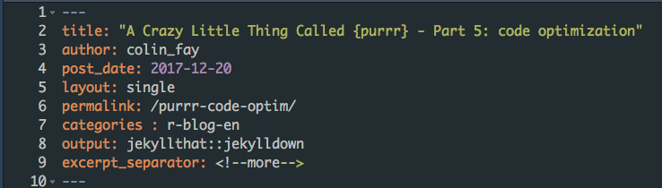
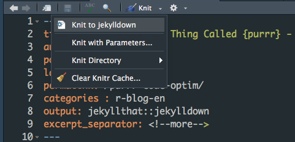

<!-- README.md is generated from README.Rmd. Please edit that file -->

# jekyllthat

Basic RMarkdown to Github Flavored Jekyll, usefull for writting posts on
a blog hosted on GitHub, straight from RStudio.

## About

If ever you start a blog today, you definitely should use
[Blogdown](https://github.com/rstudio/blogdown), which is the best tool
to create a blog within RStudio.

But if (as me), you haven’t had the time to convert your blog to
Blogdown, this package is here to help you being more efficient with
RStudio and Jekyll. This is the package I use for
[colinfay.me](http://colinfay.me).

{jekyllthat} contains :

  - An RStudio Rmd template that you can get from New File \> RMarkdown
    \> From Template

  - A Markdown format to turn Rmd into a github md for Jekyll. If you’re
    not using the template, add to your Rmd yaml :

`output: jekyllthat::jekylldown`

## Worflow

### Before using

The easier worflow is to keep your Rmd inside the `_posts` folder. If
you want to do that, you should specify jekyll to ignore this in your
config.yml. You can manually specifiy this in the `exclude` part, by
adding :

  - “\*.Rmd"

You can also use the `config_rmd()`, that takes as argument the path to
your `config.yml`. But as it is a 15 seconds job to do it manually, you
should definitely do it manually.

## How to use

  - Create a new post with New File \> RMarkdown \> From Template

  - Fill / Modify the yaml as usual.

  - Write and save into the `_posts` folder

  - Knit to `jekylldown`

  - Push to github

If you’ve followed the step described in “Before using”, you can push
everything (Rmd, folders, md), only the .md will be built for your
website.

## To Do

  - Create a Shiny Widget for post creation

## Contact

Questions and feedbacks [welcome](mailto:contact@colinfay.me)\!

You want to contribute ? Open a
[PR](https://github.com/ColinFay/jekyllthat/pulls) :) If you encounter a
bug or want to suggest an enhancement, please [open an
issue](https://github.com/ColinFay/jekyllthat/issues).

Please note that this project is released with a [Contributor Code of
Conduct](CONDUCT.md). By participating in this project you agree to
abide by its terms.
